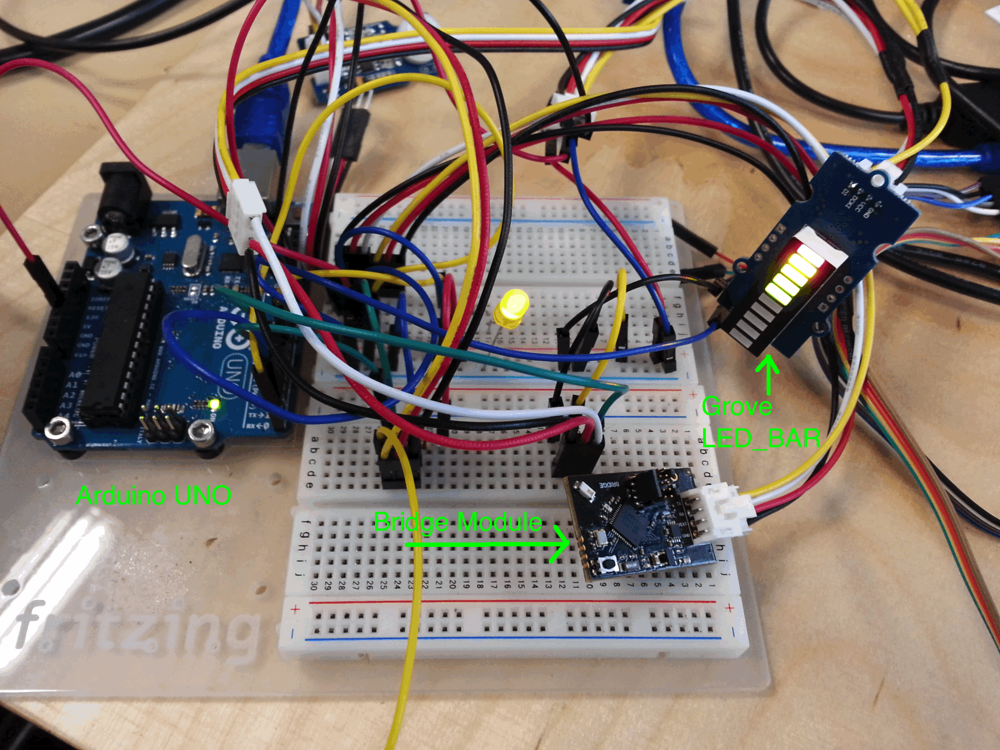

Introduction
------------
Welcome to the **Bridge library for Arduino**.
This repository contains a library which allows you to connect the Wunderbar Bridge/Grove module to the [Arduino UART](http://arduino.cc/) and in just 10 minutes have an easy gateway to the **relayr Cloud Platform**

## Getting Started

Below is a step by step tutorial of how to install and use the repository as well as a sketch example to get you inspired before you start your own project.

### 1. Installing the Library

There are two methods of installing the library:

#### Method 1: Importing the *zip* file

* Download the repository as a **.zip** file from [here](https://github.com/relayr/Arduino-Bridge-Library/archive/master.zip) and unzip it.
* In the *[Arduino IDE software](http://arduino.cc/en/main/software)*, navigate to *"Sketch > Import Library"*. At the top of the drop down list, select the option to *"Add Library''*.
* You will be prompted to select the library you would like to add. Navigate to the *.zip* file's location and open it.
* Restart the *Arduino IDE* and go to the *"Sketch > Import Library"* menu. You should now see the library at the bottom of the drop-down menu. It is ready to be used in your sketch. The *Wunderbar Bridge* example should also be available in the list.

#### Method 2: Using *git clone*

* Close the *Arduino IDE*.
* If you have **git** installed just go to the Arduino folder and perform a 

	`git clone https://github.com/relayr/Arduino-Bridge-Library.git`.
	
	On *Windows* machines, it is likely to be cloned under *"My Documents\Arduino\"*. For *Mac* users, it is likely to be cloned under *"Documents/Arduino/"*. On *Linux*, the clone will create a folder in your sketchbook.

* Restart the *Arduino IDE* and go to the *"Sketch > Import Library"* menu. You should now see the library at the bottom of the drop-down menu. It is ready to be used in your sketch. The *Wunderbar Bridge* example should also be available in the list.

### 2. Flashing the UART firmware on the Bridge Module

In order to allow the *Bridge Module* to communicate with the *Arduino* over [UART](http://en.wikipedia.org/wiki/Universal_asynchronous_receiver/transmitter), it is necessary to flash the Bridge UART Firmware.

Follow our [instructions for flashing a Sensor Module](https://developer.relayr.io/documents/HowTos/Flashing) in order to replace the existing firmware on the Grove/Bridge module with the compatible firmware for connecting to Arduino.

The new firmware file is the ["sensor\_bridge\_fw\_UART.hex"](https://github.com/relayr/Arduino-Bridge-Library/blob/master/libraries/WunderbarBridge/sensor_bridge_fw_UART.hex) file, located inside the */libraries* folder.

### 3. Connecting  the Bridge Module to Arduino

#### Necessary connections:
The connections listed below are the necessary ones for *Arduino UNO*. For other Arduino versions please check the *pin* numbers.

##### Connection to the Bridge

The easiest way of connecting the two is using the [*"Grove Servo cable"*](http://www.seeedstudio.com/depot/grove-branch-cable-for-servo5pcs-pack-p-753.html?cPath=178_179) from Seedstudio. Below is the list of connections defined by Pin number / Name:

 **Bridge:** --------- **Arduino:** 

*  **1 - Tx** ----------> **0 - Rx**
* **2 - Rx** ----------> **1 - Tx**
* **3 - Vcc** ---------> **5 Volts**
* **4  - Gnd** ---------> **GND**

##### Optional: Debugging connection to the PC serial port

In order to debug the application, and see, for instance, what data is coming from the cloud, it could be very helpful to connect a second serial port to the *Arduino*. For this, the library uses the *Software Serial Library* (which comes with the *Arduino IDE*, no need to import it). 

Any USB-to-Serial converter such as [this](http://www.amazon.com/PL2303HX-RS232-Cable-Module-Converter/dp/B008AGDTA4) should work. Below is the list of connections defined by Pin number / Name:

**Arduino:** ------ **PC Serial port:**

*  **10 - Rx** --------> **Tx**
* **11 - Tx** --------> **Rx**
* **GND** -----------> **GND**

**Note:** The example sketch defines *pins* 10 & 11 as the connecting ones to the *Software Serial* port, however, this can be changed to any available digital pin.

### 4. Viewing The URAT Output

The output sent over UART can be seen with any **Serial Monitor Software**. Below we've listed two examples of Serial monitors which could be used for this purpose:

* For *Linux/OSx* the *"screen"* application comes with the OS. It can be used from the terminal with `screen /dev/tty.USBSerialXXX 115200` where XXX is the virtual serial port created when the cable is connected to the machine and 115200 is the [*baud rate*](http://en.wikipedia.org/wiki/Symbol_rate) used in the example. Other converters may use a different name base. 
List the *tty* devices under */dev* to get the correct name base.

* For *Windows*, a common serial monitor is ["PUTTY"](http://www.putty.org/). [Realterm](http://realterm.sourceforge.net/) also provides useful funcionalities. You may refer to their respective documentation for configuration options. See [PUTTY documentation](http://www.chiark.greenend.org.uk/~sgtatham/putty/docs.html ) and [Realterm documentation](http://realterm.sourceforge.net/).

## Using the library

1. Include the *SoftwareSerial* and *WunderbarBridge* headers:

		#include <SoftwareSerial.h>
		#include <WunderbarBridge.h>

2. Instantiate the Bridge class, including the *DEBUX_RX*, *DEBUG_TX* pin numbers and *baurate* to use: `Bridge bridge = Bridge(DEBUG_RX, DEBUG_TX, 115200);`

3. The serial port library calls a handler upon receiving a new byte in the buffer. Therefore, it is necessary to call the *processSerial()* method of the bridge library when this happens:

		void serialEvent(){
		  bridge.processSerial();
		}

4. The *bridge.newData* flag will be set by the library when a new packet is received from the cloud. 
The received payload can be retrieved with the *getData()* method which returns a *bridge_payload_t* struct: `bridge_payload_t rxPayload = bridge.getData();`.

	The *bridge_payload_t* struct contains 2 fields: *length* (the payload length) and a uint8_t array (*payload[]*) which contains the received data.

5. To send data to the cloud, use the method *sendData(uint8_t payload[], int size);*
    
	For example:

		uint8_t dataOut[] = {1, 2, 3};
		bridge.sendData(dataOut, sizeof(dataOut));

We hope that you'd utilize our Grove Bridge in your future projects. The realm of possibilities is as vast as your imagination. Arduino is just the beginning. Stay tuned for more Grove delights to come!